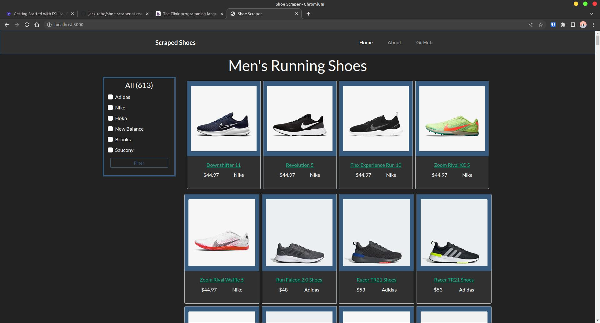

# Running Shoe Scraper

## Purpose
Aggregates and displays product data from multiple websites that sell running shoes. Data displayed includes the shoe image, sale price of the shoe, and a direct link to where the shoe can be purchased from.



## Prerequisites
- Python 3.8+
- Node 17.9+

## Local Installation
- clone the repo and cd into project
```bash
git clone git@github.com:jack-rabe/shoe-scraper.git
cd shoe-scraper
```
- install Python and Node dependencies
```
pip install -r requirements.txt
npm install
```
- scrape shoes from any websites you want data from by running the appropriate script
```bash
cd scraping
# run individual scripts like this
python nike_scraper.py
python brooks.py
# and then combine all data into a single file
python merge.py
cd .. 
```
- start up the server
```bash
npm run start
```
- navigate to localhost:3000 to view the website

